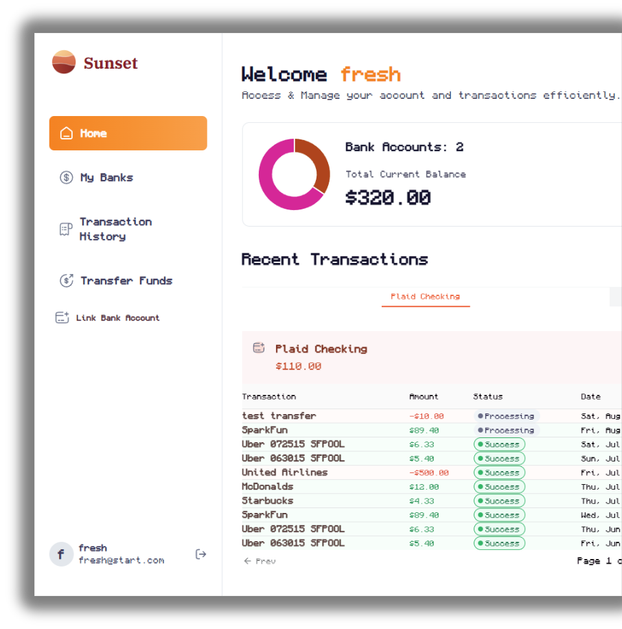
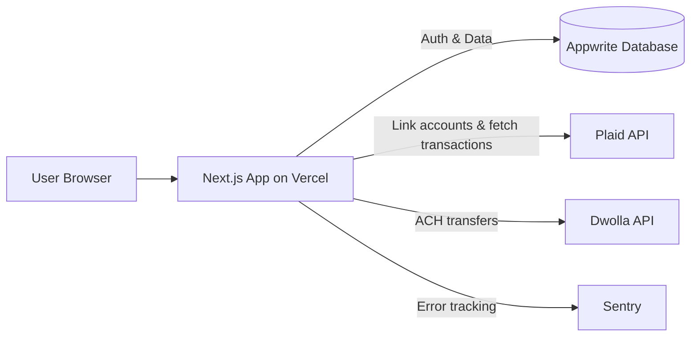

<div align="center">

# 🌅 Sunset

**A modern personal finance & banking dashboard** — connect real bank accounts, track balances, view transaction history, and transfer funds between accounts, all in one clean interface.

Built with Next.js, TypeScript, Tailwind CSS, and shadcn/ui — integrating [Plaid](https://plaid.com/) for bank connectivity and [Dwolla](https://www.dwolla.com/) for ACH money transfers.

### 🔗 [Live Demo](https://sunset-rk1r.vercel.app)



</div>

## ✨ Features

- **Secure authentication** — email/password sign-up & sign-in backed by Appwrite Auth
- **Bank account linking** — connect real financial institutions through Plaid Link
- **Multi-bank dashboard** — view total balances, per-account balances, and account details across all linked banks
- **Recent transactions** — paginated, categorized transaction feed pulled live from Plaid
- **Transaction history** — searchable, filterable full history per account with category breakdown (donut chart)
- **Fund transfers** — send money between accounts via Dwolla ACH transfers, with bank/recipient lookup
- **Responsive UI** — polished, accessible interface with a collapsible sidebar and mobile navigation
- **Error monitoring** — integrated with Sentry for real-time error tracking across client, server, and edge runtimes

## 🛠 Tech Stack

| Layer | Technology |
|---|---|
| Framework | [Next.js 16](https://nextjs.org/) (App Router, Server Actions) |
| Language | [TypeScript](https://www.typescriptlang.org/) |
| Styling | [Tailwind CSS](https://tailwindcss.com/) + [shadcn/ui](https://ui.shadcn.com/) |
| Forms & Validation | [React Hook Form](https://react-hook-form.com/) + [Zod](https://zod.dev/) |
| Charts | [Chart.js](https://www.chartjs.org/) / react-chartjs-2 |
| Auth & Database | [Appwrite](https://appwrite.io/) |
| Bank Connectivity | [Plaid API](https://plaid.com/docs/) |
| Payments / ACH Transfers | [Dwolla API](https://developers.dwolla.com/) |
| Monitoring | [Sentry](https://sentry.io/) |
| Hosting | [Vercel](https://vercel.com/) (app) + [Appwrite Cloud](https://cloud.appwrite.io/) (database) |

## 🏗 Architecture

Sunset is a full-stack Next.js application — the frontend, API routes, and server actions are all built and deployed together on **Vercel**, while **Appwrite** is used purely as the backend database and authentication provider (users, bank connections, and transaction records). Bank data itself is never stored directly — Plaid provides live account/transaction data, and Dwolla handles the movement of funds between accounts.



## 📂 Project Structure

```
app/                    # Next.js App Router pages & layouts
  (auth)/               # Sign-in / sign-up
  (root)/               # Authenticated app: home, my banks, transfers, history
components/             # Reusable UI components (dashboard widgets, forms, tables)
  ui/                    # shadcn/ui primitives
lib/
  actions/               # Server actions (user, bank, transaction, dwolla)
  appwrite.ts            # Appwrite client setup
  plaid.ts               # Plaid client setup
constants/               # App-wide constants (nav links, bank icons, etc.)
types/                   # Shared TypeScript types
```

## 🚀 Getting Started

### Prerequisites

- Node.js 18+
- An [Appwrite](https://appwrite.io/) project (database + collections for users, banks, and transactions)
- A [Plaid](https://plaid.com/) developer account (sandbox works for local dev)
- A [Dwolla](https://www.dwolla.com/) sandbox account

### Installation

```bash
git clone https://github.com/<your-username>/sunset.git
cd sunset
npm install
```

### Environment Variables

Create a `.env.local` file in the project root:

```bash
# Appwrite
APPWRITE_ENDPOINT=
APPWRITE_PROJECT=
APPWRITE_KEY=
APPWRITE_DATABASE_ID=
APPWRITE_USER_COLLECTION_ID=
APPWRITE_BANK_COLLECTION_ID=
APPWRITE_TRANSACTION_COLLECTION_ID=

# Plaid
PLAID_CLIENT_ID=
PLAID_SECRET=
PLAID_ENV=sandbox
PLAID_PRODUCTS=auth,transactions,identity
PLAID_COUNTRY_CODES=US,CA

# Dwolla
DWOLLA_KEY=
DWOLLA_SECRET=
DWOLLA_ENV=sandbox

# Misc
NEXT_PUBLIC_SITE_URL=http://localhost:3000
```

### Run the app

```bash
npm run dev
```

Open [http://localhost:3000](http://localhost:3000) to view it in the browser.

## 📦 Deployment

- **Vercel** hosts the Next.js application (frontend, API routes, and server actions).
- **Appwrite** hosts the database (users, linked banks, transaction metadata) and handles authentication.

## 📄 License

This project is for educational/portfolio purposes.
